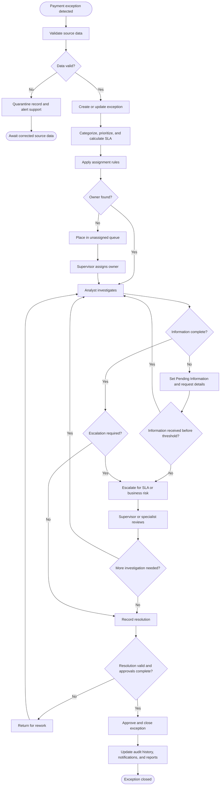
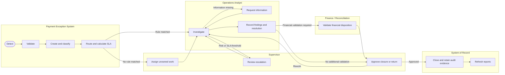
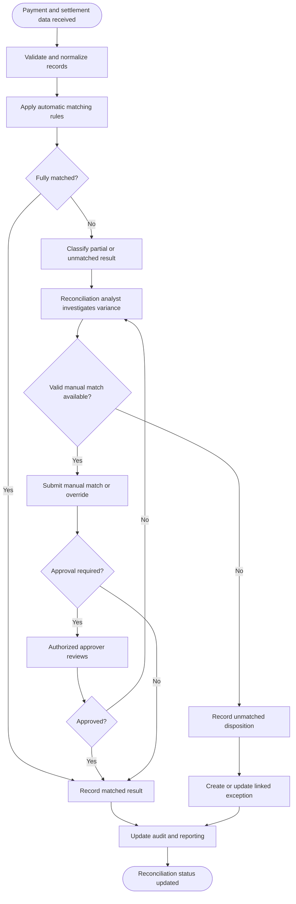
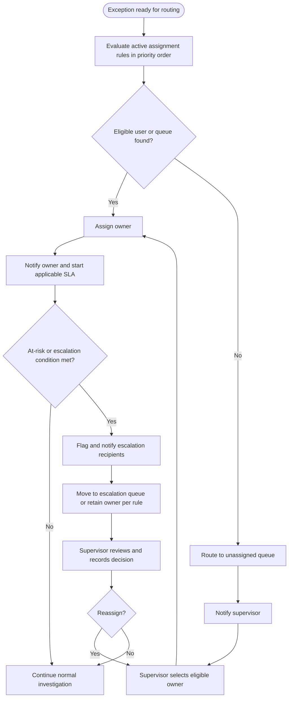
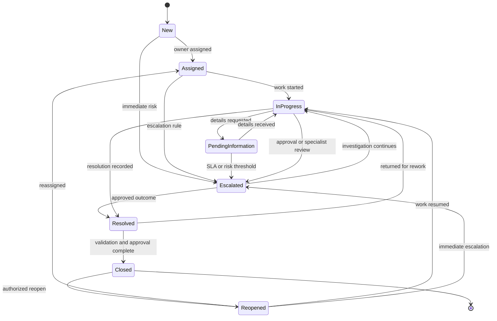

# Business Process Flow

## Payment Exception Management System

| Document field | Value |
|---|---|
| Status | Draft for stakeholder review |
| Version | 1.0 |
| Date | August 7, 2026 |
| Related BRD | `documentation/BusinessRequirementsDocument.md` |
| Related FRD | `documentation/FunctionalRequirementsDocument.md` |
| Editable BPMN files | `visio/PaymentExceptionLifecycle.bpmn`, `visio/PaymentReconciliation.bpmn` |

## 1. Purpose

This document defines the end-to-end business process for detecting, assigning, investigating, resolving, reconciling, and closing payment exceptions. It identifies process participants, decision points, controls, exception paths, inputs, outputs, and status changes.

## 2. Process participants

| Participant | Responsibility |
|---|---|
| Source systems | Provide payment, settlement, and reference data. |
| Payment Exception System | Validate data, create exceptions, apply rules, calculate SLAs, notify users, and maintain audit history. |
| Operations Analyst | Investigate assigned exceptions, request information, document findings, and propose resolution. |
| Reconciliation Analyst | Investigate payment and settlement differences and record match or disposition outcomes. |
| Supervisor | Assign work, review escalations, approve controlled actions, and authorize closure or rework. |
| Finance or Accounting | Confirm financial impact or disposition when required. |
| Compliance or Risk | Review high-risk cases and required evidence when applicable. |
| Reporting platform | Refresh operational and executive reporting from approved data. |

## 3. End-to-end payment exception flow

## 4. Swimlane business flow

## 5. Payment reconciliation flow

## 6. Assignment and escalation flow

## 7. Status lifecycle

## 8. Detailed process steps

| Step | Owner | Activity | Key input | Output or status | Primary control |
|---|---|---|---|---|---|
| 1 | System | Receive and validate source event. | Payment or reconciliation data | Valid event or quarantined record | Required fields, format, duplicate key, source authorization |
| 2 | System | Create or update exception. | Valid source event | Unique exception in New status | Idempotency and immutable source references |
| 3 | System | Categorize and prioritize. | Exception attributes and active rules | Category, priority, SLA target | Effective-dated rules and audit record |
| 4 | System or Supervisor | Assign responsible owner. | Routing rules and eligible users | Assigned status and accountable owner | Role, team, scope, workload, fallback queue |
| 5 | Analyst | Review payment, exception, and related history. | Assigned exception | In Progress status | Record-level authorization and concurrency control |
| 6 | Analyst | Request missing information when necessary. | Investigation findings | Pending Information status | Required reason and follow-up date |
| 7 | System or Supervisor | Escalate based on risk, value, age, or SLA. | Threshold event | Escalated status or flag | Approved escalation matrix and notification |
| 8 | Analyst | Record investigation outcome and proposed resolution. | Complete evidence | Resolved status pending approval where required | Mandatory resolution code and summary |
| 9 | Supervisor or Approver | Validate resolution and required approvals. | Resolution and evidence | Approved closure or rework | Authority matrix and segregation of duties |
| 10 | System | Close and publish outcomes. | Approved resolution | Closed status, audit record, updated reports | Immutable history and controlled reporting data |

## 9. Decision rules

| Decision | Rule |
|---|---|
| Data valid? | Required fields, formats, references, source authorization, and duplicate identity pass validation. |
| Owner found? | An active assignment rule returns an eligible user or queue within the exception’s authorized scope. |
| Information complete? | All category-specific mandatory information and evidence required for a resolution are available. |
| Escalation required? | A configured priority, value, risk, aging, SLA, policy, or approval condition is met. |
| Resolution valid? | Required resolution code, summary, evidence, reconciliation state, and approvals are complete. |
| Fully matched? | Approved match keys and amount or tolerance rules are satisfied for the applicable payment and settlement records. |
| Manual match valid? | Records are eligible, not incompatibly matched, and satisfy configured manual-match constraints. |
| Approval required? | Value, risk, override type, business unit, or segregation-of-duties policy requires approval. |

## 10. Alternate and exception paths

| Condition | Process response |
|---|---|
| Invalid inbound data | Quarantine the record, retain the safe rejection reason, and alert support. |
| Duplicate source event | Treat processing as idempotent and do not create duplicate exceptions or actions. |
| No assignment match | Place the exception in the approved unassigned queue and notify the supervisor. |
| Assignee becomes inactive | Prevent new assignments and expose open work for supervisor reassignment. |
| Missing investigation information | Move to Pending Information, record a follow-up date, and apply approved SLA pause behavior. |
| SLA threshold reached | Flag the exception, notify recipients, and apply the configured escalation route. |
| Resolution validation fails | Keep the exception open and identify missing or invalid information. |
| Approval rejected | Return the exception to investigation with the decision and reason retained. |
| Concurrent update | Prevent silent overwrite and require refresh or reconciliation of changes. |
| Integration or notification failure | Record a correlation ID, retry according to policy, and alert support after retry exhaustion. |

## 11. Inputs and outputs

### Inputs

- Payment and settlement events.
- Reconciliation results and source references.
- User, role, team, and business-scope data.
- Exception categories, priorities, resolution codes, SLAs, calendars, and routing rules.
- Analyst notes, supporting references, dispositions, and approvals.

### Outputs

- Assigned and prioritized exception records.
- Status, SLA, escalation, and ownership updates.
- Resolutions, reconciliation dispositions, and closure decisions.
- Notifications and operational alerts.
- Immutable audit events.
- Operational, management, executive, and compliance reporting data.

## 12. Key controls

- Role-based and record-level authorization at every action.
- Masking of sensitive payment information.
- Unique identifiers and idempotent source-event processing.
- Mandatory reasons for reassignment, escalation, override, reopening, and controlled disposition.
- Segregation of duties for high-risk approvals and overrides.
- Effective-dated configuration and rule validation before activation.
- Optimistic concurrency to prevent silent overwrite.
- Immutable history for material user and system actions.
- Consistent KPI definitions and reporting filters.

## 13. Process performance measures

- Time from detection to creation.
- Time from creation to assignment.
- Time from assignment to first analyst action.
- Average and median resolution and closure time.
- Percentage within SLA and percentage at risk or breached.
- Unassigned count and age.
- First-time resolution and reopen rate.
- Escalation rate and approval turnaround time.
- Automatic match rate, manual match rate, unmatched value, and variance aging.
- Backlog, throughput, and exception volume by root cause.

## 14. Validation and approval

The diagrams and flow must be reviewed with Payment Operations, Reconciliation, Finance, Compliance, Product, and Technology. Items requiring confirmation include assignment precedence, SLA pause behavior, approval thresholds, reconciliation tolerances, escalation paths, and final status-transition authority.

| Approver role | Name | Decision | Date |
|---|---|---|---|
| Business owner |  |  |  |
| Product owner |  |  |  |
| Payment Operations |  |  |  |
| Reconciliation or Finance |  |  |  |
| Compliance or Risk |  |  |  |
| Technology |  |  |  |

## 15. Revision history

| Version | Date | Author | Description |
|---|---|---|---|
| 1.0 | August 7, 2026 | Project team | Initial BPMN and business process flow baseline. |
